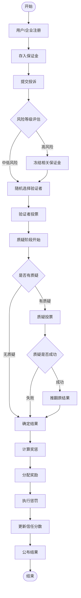

# FoodGuard 食品安全治理系统

## 🎯 项目概述

FoodGuard是一个基于Web3技术的去中心化食品安全治理系统，旨在解决传统食品安全投诉处理的透明度不足、监管不力等问题。通过区块链技术和DAO治理机制，构建一个公平、透明、高效的食品安全投诉和处理平台。

### 核心特性

- **🔍 透明治理**: 所有投诉、投票、质疑过程完全透明，可追溯
- **💰 激励机制**: 参与验证和质疑的贡献者获得奖励，违规者受到惩罚
- **⚖️ 公正仲裁**: 多重验证和质疑机制确保结果公正
- **🛡️ 保证金机制**: 通过保证金约束各方行为，提高参与门槛
- **📊 信任评分**: 基于历史行为建立信任分数系统

## 🏗️ 系统架构

```
┌─────────────────┐
│   主合约层      │
│ FoodGuardGov    │ ← 统一入口，流程控制
└─────────────────┘
         │
┌─────────────────┐
│   业务逻辑层    │
├─────────────────┤
│ VotingSystem    │ ← 投票验证
│ ChallengeSystem │ ← 质疑处理  
│ RewardSystem    │ ← 奖惩分配
└─────────────────┘
         │
┌─────────────────┐
│   基础设施层    │
├─────────────────┤
│ AccessControl   │ ← 权限管理
│ DepositManager  │ ← 保证金管理
│ Utils Library   │ ← 工具函数
└─────────────────┘
```

## 📋 治理流程

### 完整流程图



### 详细步骤

1. **用户注册**: 投诉者、企业、DAO成员注册并存入保证金
2. **投诉提交**: 投诉者提交食品安全投诉，包含地点、描述、证据
3. **风险评估**: 系统自动评估风险等级（高/中/低）
4. **验证者选择**: 根据风险等级随机选择合适数量的DAO成员
5. **投票验证**: 验证者基于证据投票（支持/反对投诉）
6. **质疑阶段**: 任何人可对投票结果提出质疑
7. **质疑投票**: 对质疑进行投票验证
8. **结果确定**: 综合投票和质疑结果确定最终结果
9. **奖惩执行**: 奖励正确参与者，惩罚违规者
10. **信息公布**: 公开透明发布案件处理结果

## 📁 合约结构

### 核心合约

| 合约名称 | 功能描述 | 主要职责 |
|---------|---------|---------|
| **FoodGuardGovernance** | 主治理合约 | 统一入口，流程协调 |
| **AccessControl** | 访问控制 | 用户注册、权限验证 |
| **DepositManager** | 保证金管理 | 保证金存取、冻结 |
| **VotingSystem** | 投票系统 | 验证者投票处理 |
| **ChallengeSystem** | 质疑系统 | 质疑提交和投票 |
| **RewardPunishmentSystem** | 奖惩系统 | 奖励分配、惩罚执行 |

### 接口和工具

| 文件名称 | 功能描述 |
|---------|---------|
| **IFoodGuard.sol** | 核心接口定义 |
| **Utils.sol** | 工具函数库 |

## 🚀 快速开始

### 环境要求

- Solidity ^0.8.20
- Foundry
- Node.js (可选，用于前端交互)

### 安装依赖

```bash
# 克隆项目
git clone <项目地址>
cd foodguard-contract

# 安装Foundry依赖
forge install
```

### 编译合约

```bash
forge build
```

### 运行测试

```bash
forge test
```

### 部署合约

```bash
# 设置环境变量
export PRIVATE_KEY=your_private_key
export RPC_URL=your_rpc_url

# 部署到测试网
forge script script/Deploy.s.sol --rpc-url $RPC_URL --broadcast
```

## 🔧 配置参数

### 系统关键参数

| 参数名称 | 默认值 | 说明 |
|---------|-------|------|
| 最小保证金 | 0.01 ETH | 参与系统的最低保证金 |
| 最大保证金 | 100 ETH | 单用户最大保证金限制 |
| 投票期限 | 1-7天 | 根据风险等级动态调整 |
| 质疑期限 | 2天 | 质疑阶段持续时间 |
| 最小验证者 | 5人 | 最少验证者数量 |
| 最大验证者 | 15人 | 最多验证者数量 |
| 基础奖励率 | 10% | 奖励池基础比例 |
| 惩罚率 | 20% | 错误行为惩罚比例 |

## 🎮 使用示例

### 用户注册

```solidity
// 注册为DAO成员
accessControl.applyForDAOMembership{value: 0.1 ether}();

// 企业注册
accessControl.registerEnterprise{value: 0.1 ether}(
    "企业名称",
    "注册号",
    "营业执照哈希"
);
```

### 存入保证金

```solidity
// 存入通用保证金
governance.submitDeposit{value: 1 ether}(0);

// 为特定案件存入保证金
governance.submitDeposit{value: 0.5 ether}(caseId);
```

### 提交投诉

```solidity
uint256 caseId = governance.createComplaint(
    enterpriseAddress,
    "发生地点",
    "投诉描述",
    "证据描述",
    evidenceFileHashes
);
```

### 参与投票

```solidity
// 验证者投票
governance.submitVote(
    caseId,
    true, // 支持投诉
    "投票理由",
    evidenceFileHashes
);
```

### 提交质疑

```solidity
// 质疑投票结果
governance.submitChallenge(
    caseId,
    true, // 质疑原结果
    "质疑理由",
    evidenceFileHashes
);
```

## 📊 经济模型

### 奖励机制

- **正确验证者**: 获得基础奖励 + 权重奖励
- **成功质疑者**: 获得奖励池的5%奖励
- **诚实参与者**: 提升信任分数

### 惩罚机制

- **错误验证者**: 扣除保证金，降低信任分数
- **失败质疑者**: 扣除质疑保证金
- **虚假投诉者**: 扣除保证金，限制参与

### 费用结构

- **平台手续费**: 2% (从奖励池扣除)
- **提取手续费**: 1% (提取保证金时)
- **质疑保证金**: 0.05 ETH (防止恶意质疑)

## 🔒 安全特性

### 访问控制

- 基于角色的权限管理
- 多重身份验证
- 黑名单机制

### 资金安全

- 重入攻击防护
- 保证金锁定机制
- 紧急暂停功能

### 投票安全

- 随机验证者选择
- 权重投票机制
- 时间窗口限制

## 🧪 测试覆盖

项目包含全面的测试用例，覆盖：

- ✅ 用户注册和权限验证
- ✅ 保证金存取和管理
- ✅ 投诉创建和处理
- ✅ 投票和质疑流程
- ✅ 奖惩计算和分配
- ✅ 边界条件和异常处理

运行特定测试：

```bash
# 运行所有测试
forge test

# 运行特定测试文件
forge test --match-path test/FoodGuardGovernance.t.sol

# 显示详细输出
forge test -vvv
```


