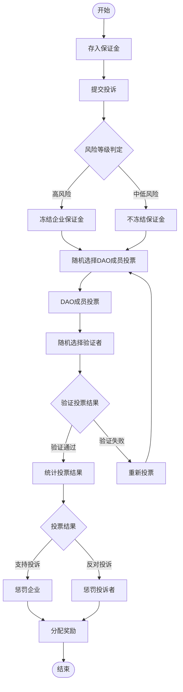

# FoodGuard DAO - 去中心化食品安全投诉治理系统

FoodGuard DAO是一个基于区块链的去中心化食品安全投诉和治理系统，通过DAO投票机制和经济激励模型来确保食品安全投诉的公正处理。

## 系统概述

### 主要功能
- 🏛️ **DAO治理投票**：通过去中心化的方式处理食品安全投诉
- 💰 **保证金机制**：投诉者和企业都需要存入保证金以确保诚信参与
- 🎯 **风险评估**：基于AI算法自动评估投诉的风险等级
- 🎲 **随机选择**：随机选择DAO成员进行投票和验证，确保公正性
- 💎 **奖励分配**：对诚实的参与者进行奖励，惩罚虚假参与者
- 🏦 **质押系统**：用户可以质押资金获得利息收益

### 系统流程



## 合约架构

### 核心合约

1. **FoodGuardDAO.sol** - 主合约
   - 投诉管理
   - DAO成员管理
   - 投票和验证流程
   - 奖励分配
   - 质押功能

2. **RiskAssessment.sol** - 风险评估合约
   - 基于关键词的风险评估
   - 企业历史记录管理
   - 声誉评分系统

3. **RandomSelector.sol** - 随机选择合约
   - 随机选择投票者
   - 随机选择验证者
   - 防止重复选择

4. **interfaces/IFoodGuardDAO.sol** - 接口定义
   - 数据结构定义
   - 事件定义
   - 函数接口

## 快速开始

### 环境要求
- Node.js >= 16
- Foundry
- Git

### 安装

```bash
# 克隆仓库
git clone <repository-url>
cd foodguard-contract

# 安装依赖
forge install

# 编译合约
forge build
```

### 运行测试

```bash
# 运行所有测试
forge test

# 运行详细测试
forge test -vvv

# 运行特定测试
forge test --match-test testCompleteHighRiskComplaintFlow
```

### 部署

```bash
# 设置环境变量
export PRIVATE_KEY=<your-private-key>
export MAINNET_RPC_URL=<rpc-url>

# 部署到本地网络
forge script script/Deploy.s.sol --rpc-url localhost

# 部署到测试网
forge script script/Deploy.s.sol --rpc-url sepolia --broadcast --verify
```

## 主要功能详解

### 1. 投诉流程

#### 提交投诉
```solidity
function submitComplaint(
    address _company,
    string memory _description,
    RiskLevel _riskLevel
) external returns (uint256)
```

#### 投票
```solidity
function submitVote(
    uint256 _complaintId,
    bool _support,
    string memory _evidence
) external
```

#### 验证
```solidity
function verifyVote(
    uint256 _complaintId,
    bool _verified
) external
```

### 2. 质押系统

#### 质押资金
```solidity
function stake() external payable
```

#### 提取质押
```solidity
function withdrawStake(uint256 _amount) external
```

#### 计算利息
```solidity
function calculateInterest(address _staker) public view returns (uint256)
```

### 3. 保证金管理

#### 存入保证金
```solidity
function depositGuarantee() external payable
```

#### 提取保证金
```solidity
function withdrawDeposit(uint256 _amount) external
```

## 经济模型

### 保证金要求
- 最低保证金：0.1 ETH
- 投诉者和企业都需要存入保证金
- 高风险投诉会冻结企业保证金

### 奖励分配
- 90%的奖金池分配给诚实投票者
- 10%进入储备基金
- 储备基金用于支付质押利息

### 惩罚机制
- 败诉方的保证金被没收
- 虚假验证者被罚款保证金的10%
- 被罚资金进入奖金池

## 风险等级评估

系统根据以下因素自动评估风险等级：

### 评估维度
1. **企业历史记录**（权重40%）
   - 历史违规次数
   - 声誉评分

2. **投诉类型**（权重35%）
   - 关键词匹配
   - 严重程度分析

3. **证据质量**（权重15%）
   - 证据完整性
   - 可信度评估

4. **地理影响**（权重10%）
   - 影响范围评估
   - 区域风险因子

### 风险阈值
- 高风险：总分 ≥ 80
- 中风险：总分 ≥ 50
- 低风险：总分 < 50

## DAO治理

### 成员管理
- 只有合约所有者可以添加/移除DAO成员
- DAO成员享有投票权和验证权
- 需要足够数量的成员参与投票

### 投票要求
- 高风险投诉：需要3票
- 中低风险投诉：需要2票
- 投票结果需要验证通过才能生效

### 随机选择机制
- 使用区块hash和时间戳生成随机种子
- 确保同一投诉中不会重复选择同一成员
- 验证者不能是投票者

## 安全特性

### 重入攻击防护
- 使用OpenZeppelin的ReentrancyGuard

### 权限控制
- 基于角色的访问控制
- 关键功能仅限authorized用户

### 数据验证
- 严格的输入验证
- 状态检查和边界条件处理

### 暂停机制
- 紧急情况下可暂停合约
- 所有者可控制暂停/恢复

## 测试覆盖

### 单元测试
- ✅ 保证金存取测试
- ✅ 投诉提交测试
- ✅ 投票功能测试
- ✅ 质押功能测试
- ✅ 权限控制测试

### 集成测试
- ✅ 完整高风险投诉流程
- ✅ 完整低风险投诉流程
- ✅ 多投诉并发处理
- ✅ 奖励分配流程
- ✅ 验证失败流程
- ✅ 风险评估集成
- ✅ 随机选择集成

## 部署信息

### 合约地址（测试网）
- FoodGuardDAO: `待部署`
- RiskAssessment: `待部署`
- RandomSelector: `待部署`

### Gas费用优化
- 使用packed结构体减少存储
- 批量操作减少交易次数
- 优化循环逻辑

## 路线图

### Phase 1 ✅
- 基础合约架构
- 核心功能实现
- 完整测试覆盖

### Phase 2 🔄
- 前端界面开发
- 测试网部署
- 社区反馈收集

### Phase 3 📋
- 主网部署
- DAO治理启动
- 生态合作伙伴接入

## 贡献指南

1. Fork项目
2. 创建功能分支
3. 提交更改
4. 推送到分支
5. 创建Pull Request

## 许可证

MIT License

## 联系方式

- 项目主页：`<项目URL>`
- 技术文档：`<文档URL>`
- 社区讨论：`<Discord/Telegram>`

---

**注意**：本项目仍在开发中，请勿在生产环境中使用未经审计的代码。
