# 🛡️ FoodGuard - Food Safety Governance Contract System


A blockchain-based decentralized food safety governance system that leverages **Chainlink VRF** for fair validator selection and **Chainlink Automation** for automated governance processes, ensuring transparent and fair dispute resolution mechanisms.

## 🎯 Project Vision

Addressing core pain points in traditional food safety complaint handling:

- **🔍 Lack of Transparency**: Traditional processes are opaque, users cannot track processing progress
- **⚖️ Fairness Issues**: Lack of decentralized fair arbitration mechanisms
- **💰 Compensation Difficulties**: Long dispute resolution cycles and imperfect compensation mechanisms
- **🤝 Trust Crisis**: Lack of trusted intermediary platforms between enterprises and consumers
- **🎲 Randomness Requirements**: Need for verifiable randomness to ensure fair validator selection

## 🏗️ System Architecture

### 🧩 Core Module Architecture

```
FoodSafetyGovernance (Main Governance Contract)
├── 🏦 FundManager (Fund Management)
├── 🗳️  VotingDisputeManager (Voting Dispute Management) 
├── 🏆 RewardPunishmentManager (Reward Punishment Management)
├── 👥 ParticipantPoolManager (Participant Pool Management)
└── 🔗 Chainlink Integration
    ├── VRF (Verifiable Random Function)
    └── Automation (Automated Execution)
```

### 📚 Supporting Library Architecture

```
libraries/
├── 📋 DataStructures.sol (Unified Data Structures)
├── ❌ Errors.sol (Custom Error Definitions)
└── 📢 Events.sol (Event Definitions)
```

## 🔗 Chainlink Integration Details

### 🎲 VRF (Verifiable Random Function) Integration

**Purpose**: Ensure fairness and unpredictability in validator selection

**Core File Links**:
- 🎯 **Main Contract Integration**: [`src/FoodSafetyGovernance.sol`](./src/FoodSafetyGovernance.sol#L19-L22)

- ⚙️ **Configuration Management**: [`script/HelperConfig.s.sol`](./script/HelperConfig.s.sol#L40)

- 🚀 **Deployment Scripts**: [`script/DeployFoodguard.s.sol`](./script/DeployFoodguard.s.sol#L38-L82)

- 🔗 **Mock Contracts**: [`test/mocks/LinkToken.sol`](./test/mocks/LinkToken.sol)

### 🤖 Automation Integration

**Purpose**: Automate execution of key stage transitions in governance processes

**Integration Location**: [`src/FoodSafetyGovernance.sol`](./src/FoodSafetyGovernance.sol#L22)

**Automated Functions**:
- ✅ Automatic voting phase termination
- ✅ Automatic challenge period expiration
- ✅ Automatic reward and punishment distribution

## 🔄 Governance Process Details

### Complete Process Flow

```mermaid
graph TB
    A[👤 User Creates Complaint] --> B[🔒 Deposit Lock]
    B --> C[🎲 Chainlink VRF<br/>Random Validator Selection]
    C --> D[🗳️ Validator Voting]
    D --> E[⏰ Chainlink Automation<br/>Auto End Voting]
    E --> F[⚖️ Challenge Period Begins]
    F --> G[⏰ Chainlink Automation<br/>Auto End Challenge]
    G --> H[🏆 Reward Punishment Distribution]
    H --> I[✅ Case Completion]
```



### 🔍 Detailed Stage Description

| Stage | Description | Chainlink Function | Time Limit |
|-------|-------------|-------------------|------------|
| **Complaint Creation** | User submits complaint and evidence | - | Real-time |
| **Deposit Lock** | Lock funds from both parties to prevent malicious behavior | - | Real-time |
| **Validator Selection** | Randomly select validators | **VRF Random Selection** | Real-time |
| **Voting Phase** | Validators vote on the case | **Automation Auto-End** | 7 days |
| **Challenge Phase** | Challenge voting results | **Automation Auto-End** | 3 days |
| **Reward Distribution** | Distribute rewards based on results | - | Real-time |
| **Case Completion** | Release funds and record results | - | Real-time |

## 💰 Economic Model

### 💳 Deposit Mechanism
```yaml
Complainant Deposit: 0.1 ETH    # Prevent malicious complaints
Enterprise Deposit:  1.0 ETH    # Ensure enterprise participation
Validator Stake:     0.2 ETH    # Ensure honest validation
Challenge Deposit:   0.05 ETH   # Challenge validator decisions, encourage objectivity
```

### 📊 Fund Distribution Strategy
```yaml
Winner Reward:       70%        # Incentivize legitimate rights protection
Validator Reward:    15%        # Incentivize honest validation
Operating Costs:     10%        # System maintenance
Reserve Fund:        5%         # Risk control
```

## 📋 Project Status

### ✅ Completed Features

- [x] **Core Architecture Design** - Complete modular architecture
- [x] **Chainlink VRF Integration** - Verifiable random validator selection
- [x] **Chainlink Automation Integration** - Automated process management
- [x] **Smart Contract Development** - All core modules completed
- [x] **Compilation Optimization** - Resolved stack depth issues, using `via_ir` optimization
- [x] **Basic Testing** - Core functionality test coverage
- [x] **Deployment System** - Complete deployment and configuration scripts

## 🚀 Quick Start

### 📋 Environment Requirements

```bash
# Required Tools
Foundry >= 0.2.0        # Smart contract framework
Solidity >= 0.8.20      # Compiler version
Node.js >= 18.0.0       # Frontend development environment
Git >= 2.0.0            # Version control

# Recommended Tools
VS Code + Solidity Extension
MetaMask Browser Wallet
```

### 🛠️ Installation and Setup

```bash
# 1. Clone Repository
git clone [repository-url]
cd foodguard-contract

# 2. Install Foundry Dependencies
forge install

# 3. Compile Contracts
make build
# or
forge build

# 4. Run Tests
make test
# or detailed output
make test-v

# 5. Start Local Network
make start-anvil

# 6. Deploy to Local Network
make deploy-local
```

### ⚙️ Environment Configuration

Create and configure `.env` file:

```bash
# Copy environment variable template
cp .env.example .env
```

Configuration content:
```env
# Network Configuration
SEPOLIA_RPC_URL=https://sepolia.infura.io/v3/YOUR_PROJECT_ID
MAINNET_RPC_URL=https://mainnet.infura.io/v3/YOUR_PROJECT_ID

# Wallet Configuration
PRIVATE_KEY=0x...                    # Deployer account private key
ETHERSCAN_API_KEY=YOUR_API_KEY       # Contract verification

# Chainlink Configuration
VRF_SUBSCRIPTION_ID=123              # VRF subscription ID
LINK_TOKEN_ADDRESS=0x...             # LINK token address
VRF_COORDINATOR_ADDRESS=0x...        # VRF coordinator address
```

## 🔧 Development Tools

### 📟 Makefile Commands

```bash
# 🏗️ Build Related
make build          # Compile all contracts
make clean          # Clean build files
make size           # Check contract sizes

# 🧪 Testing Related  
make test           # Run all tests
make test-v         # Detailed test output
make test-coverage  # Generate coverage report
make test-gas       # Gas usage report

# 🚀 Deployment Related
make deploy-local   # Deploy to local Anvil
make deploy-sepolia # Deploy to Sepolia testnet
make deploy-mainnet # Deploy to mainnet (use with caution)

# 🔗 Network Management
make start-anvil    # Start local test network
make stop-anvil     # Stop local network

# 🔍 Verification and Interaction
make verify         # Verify contract source code
make format         # Format code
```

### 🏦 Module Contract Interfaces

Detailed module interface documentation:
- **Fund Management**: [`src/modules/FundManager.sol`](./src/modules/FundManager.sol)
- **Voting Disputes**: [`src/modules/VotingDisputeManager.sol`](./src/modules/VotingDisputeManager.sol)  
- **Reward Punishment**: [`src/modules/RewardPunishmentManager.sol`](./src/modules/RewardPunishmentManager.sol)
- **Participant Pool**: [`src/modules/ParticipantPoolManager.sol`](./src/modules/ParticipantPoolManager.sol)

## 🛡️ Security Features

### 🔒 Implemented Security Measures

- **✅ Reentrancy Protection**: Using OpenZeppelin's `ReentrancyGuard`
- **✅ Access Control**: Role-based fine-grained permission management  
- **✅ Pause Mechanism**: Contract pause functionality for emergency situations
- **✅ Input Validation**: Comprehensive parameter and state validation
- **✅ Integer Safety**: Solidity 0.8+ built-in overflow protection
- **✅ Randomness Security**: Chainlink VRF provides verifiable randomness

### ⚠️ Risk Assessment and Mitigation

| Risk Type | Risk Level | Mitigation Measures |
|-----------|------------|-------------------|
| **Governance Attacks** | 🟡 Medium | Economic incentives + reputation mechanism + deposits |
| **Sybil Attacks** | 🟢 Low | Deposit thresholds + KYC integration |
| **Collusion Behavior** | 🟡 Medium | VRF random selection + anonymous voting |
| **Smart Contract Vulnerabilities** | 🟡 Medium | Code audits + multiple testing |
| **Frontend Attacks** | 🟢 Low | Decentralized frontend + IPFS hosting |

### 🔍 Security Best Practices

- **Code Audits**: Recommend professional security audits before deployment
- **Progressive Deployment**: Start from testnets, gradually expand to mainnet
- **Monitoring Systems**: Real-time monitoring of abnormal transactions and behavior
- **Emergency Response**: Establish rapid response teams and procedures

## 📖 Documentation and Resources

### 📚 Technical Documentation

- **[Architecture Design Document](./docs/ARCHITECTURE.md)** - Detailed system architecture description
- **[API Reference Manual](./docs/API_REFERENCE.md)** - Complete contract interface documentation
- **[Deployment Guide](./docs/DEPLOYMENT_GUIDE.md)** - Production environment deployment instructions
- **[Security Audit Report](./docs/SECURITY_AUDIT.md)** - Security audit results

### 🔗 External Resources

- **[Chainlink VRF Documentation](https://docs.chain.link/vrf/v2/introduction)**
- **[Chainlink Automation Documentation](https://docs.chain.link/chainlink-automation/introduction)**
- **[Foundry User Guide](https://book.getfoundry.sh/)**
- **[OpenZeppelin Contract Library](https://docs.openzeppelin.com/contracts/)**

## 🤝 Contributing Guidelines

### 🛠️ Development Process

1. **Fork repository** and create feature branch
2. **Write code** and ensure all tests pass
3. **Add tests** covering new features
4. **Update documentation** explaining changes
5. **Submit PR** and wait for review

### 📝 Code Standards

- **Solidity**: Follow [Solidity Style Guide](https://docs.soliditylang.org/en/latest/style-guide.html)
- **Comments**: Use NatSpec format for function comments
- **Testing**: Each feature must have corresponding test cases
- **Security**: Follow smart contract security best practices

## 📄 License

This project is licensed under the [MIT License].

## 🙏 Acknowledgments

Thanks to the following projects and teams for their support:

- **[Chainlink](https://chain.link/)** - Providing decentralized oracle services
- **[OpenZeppelin](https://openzeppelin.com/)** - Secure smart contract library
- **[Foundry](https://getfoundry.sh/)** - Modern development framework

---

<div align="center">

**🛡️ FoodGuard - Making Food Safety Transparent and Trustworthy 🛡️**

</div>
